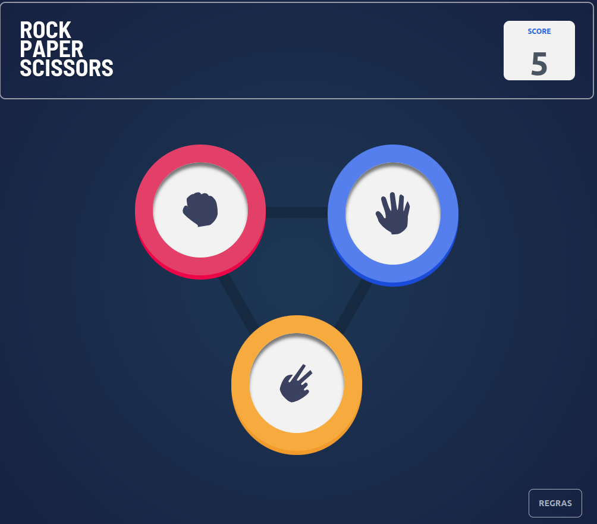
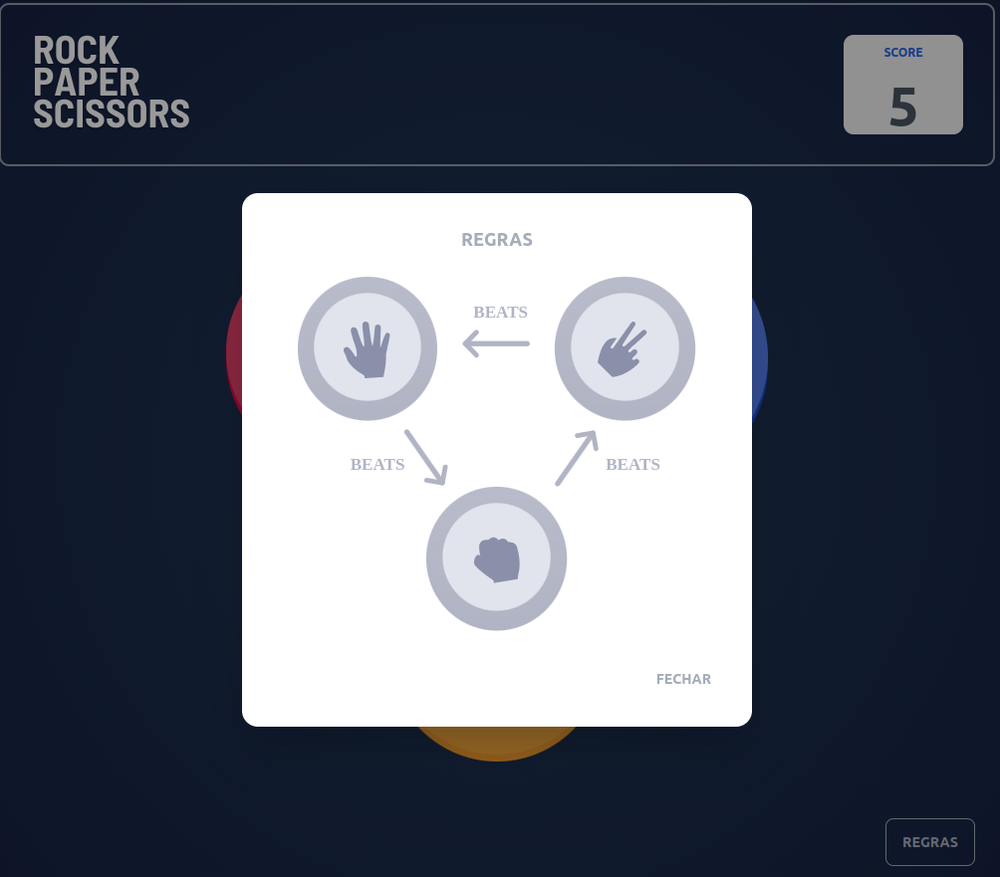
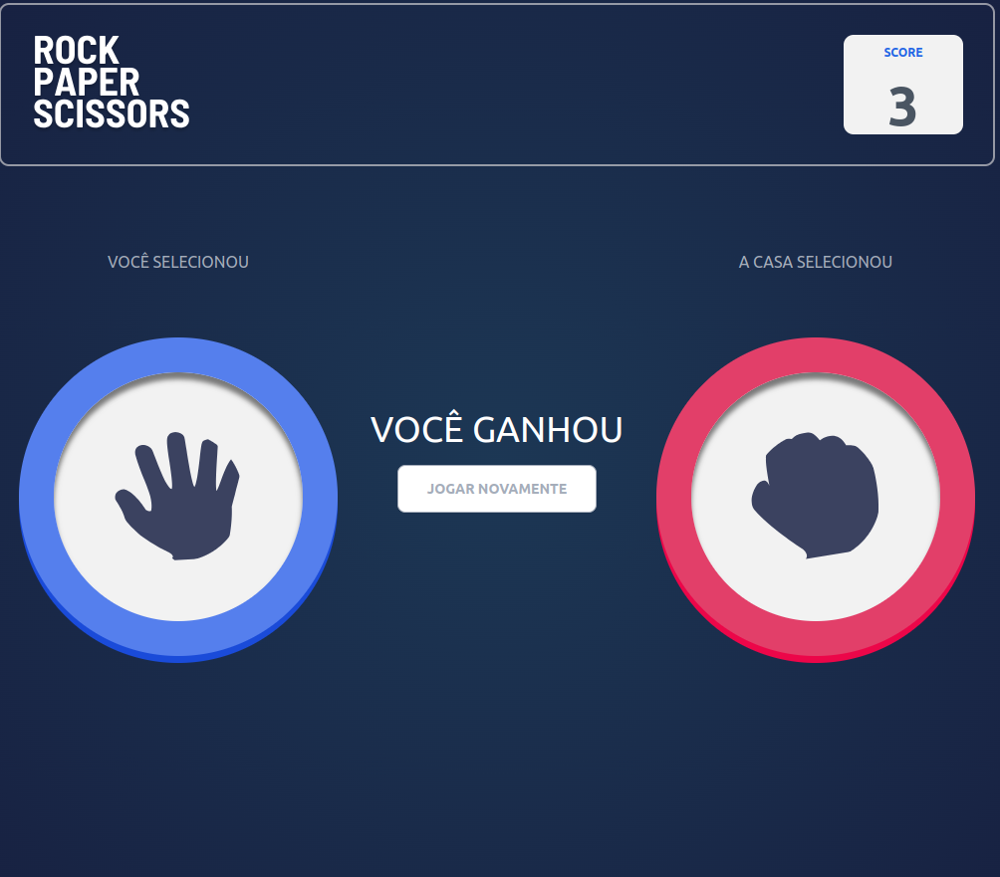
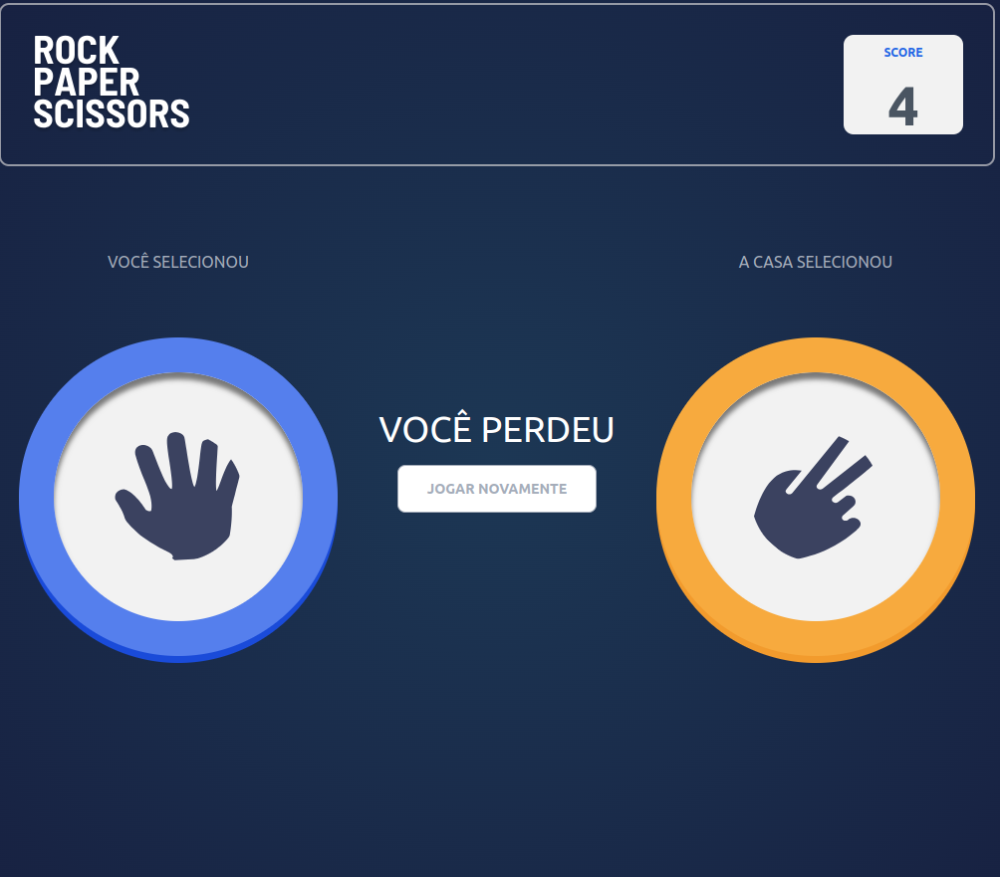
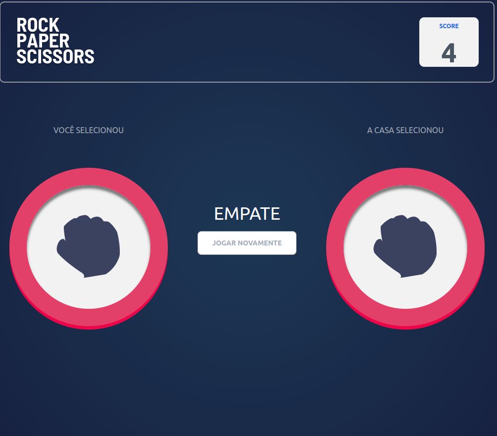

<h1 align="center"> Pedra, Papel e Tesoura Game </h1>

Pedra, Papel e Tesoura Game using VueJs, Tailwind DistUI.


## Descrição do Projeto

Game desenvolvido a partir de prints do jogo, através da plataforma Front End Mentor.

### 📌 Funcionalidades do Projeto

- `Página Inicial`: Página Inicial da Jogo.
  

- `Menu de regras`: Menu de regras do jogo.
  

- `Jogue contra o computador`: Jogue contra a máquina e se divirta., 
 
 
  

 ### 🖥️ Requisitos
 
* Vue <br>
* Tailwind <br>
* Distui <br>

### 📁 Acesso ao projeto

* Na pasta desejada, e executar o comando:
```git
git clone https://github.com/herongs/app-todo-list.git
```
* Execute o aplicativo:
```
npm run serve
```

